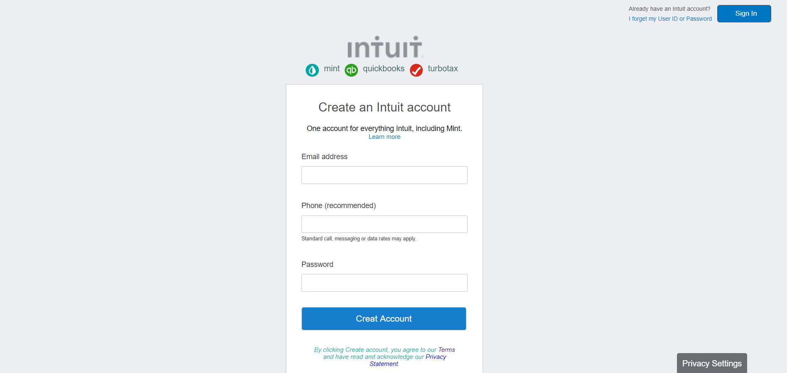

# HTML forms

> This project consists of building an HTML document that matches the appearance of mint.com’s signup page.

This project tried to clone the mint.com's signup page by using simple CSS and
HTML.

## Built With

- HTML, css
- No frameworks

## Live Demo

[Live Demo Link](https://rawcdn.githack.com/Berabjesus/HTML-Forms/ca81dee61bb195662e34cbd77dc7589830667fd5/index.html)

## Authors

👤 **Bereket Beshane**

- Github: [@githubhandle](https://github.com/Berabjesus)
- Twitter: [@twitterhandle](https://twitter.com/bereket_ababu_b)
- Linkedin: [linkedin](https://www.linkedin.com/in/bereket-beshane-a1b75a1a9/)

👤 **Mohamed Dawood**

- Github: [@githubhandle](https://github.com/MohameDawood/)
- Twitter: [@twitterhandle](https://twitter.com/Mohamedawood8)
- Linkedin: [linkedin](https://www.linkedin.com/in/mohamedawood/)

## 🤝 Contributing

Contributions, issues and feature requests are welcome!

Feel free to check the [issues page](issues/).

## Show your support

Give a ⭐️ if you like this project!

## Acknowledgments

- Thank you in advance

## 📝 License

No licence.
